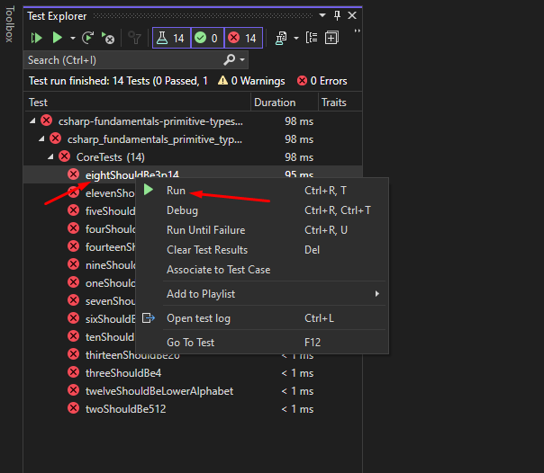

# C# Strings

## Learning Objectives
- Use common C# string operations to manipulate a URL

## Set up instructions
- Fork this repository and clone the forked version to your machine
- Open the solution file.
- Implement the requirements listed in comments in the `Core.cs` file
- When ready to test your solution, open the 'Test Explorer' file and click "Run". 

- If you need to run a single test

## Test Output

When you run a test, it's either going to pass or fail. When it fails, you'll be presented with a red dot with an x in the middle.  By clicking on the test, you getr a Test Details Summary.  On here you can see a snippet from the stack trace.  Stack traces, though intimidating, does contain some useful information.

One of the core skills of a developer is debugging. By examining the stack trace, you can see in which classes & files the failure happened, and gives you a line number at the end. Most of the lines in the stack trace are irrelevant most of the time, you want to try and identify the files that you're actually working with.
